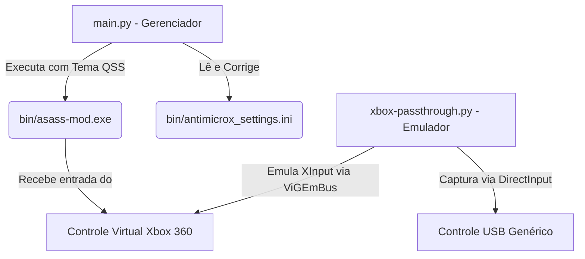

# Relatório Técnico Completo do Diretório Binário (`bin/`)
**Projeto:** AntiMicroX - ASASS Mod  
**Data de Atualização:** 2026-06-06 (Horário Local)  
**Status do Ambiente:** Saudável, migrado para Python 3 / PyQt6 e com XInput Emulation integrado.

---

## 1. Mapeamento de Arquivos da Pasta `bin/`

A pasta `bin/` contém o executável principal, as dependências do Qt6/SDL2 e o arquivo central de configurações:

| Nome do Arquivo | Tipo / Função | Tamanho | Status |
| :--- | :--- | :---: | :---: |
| **`antimicrox_settings.ini`** | Configurações do AntiMicroX (perfis e controles) | ~3 KB | **OK** (Corrigido) |
| **`asass-mod.exe`** | Executável principal (AntiMicroX com branding) | ~5.3 MB | **OK** |
| `Qt6Core.dll` | Biblioteca de execução Core do Qt6 | ~6.5 MB | **OK** |
| `Qt6Gui.dll` | Biblioteca gráfica básica do Qt6 | ~10.2 MB | **OK** |
| `Qt6Widgets.dll` | Componentes de interface do Qt6 | ~6.7 MB | **OK** |
| `Qt6Network.dll` | Suporte de rede do Qt6 | ~1.8 MB | **OK** |
| `Qt6Concurrent.dll` | Execução paralela do Qt6 | ~36 KB | **OK** |
| `SDL2.dll` | Biblioteca de polling de dispositivos de entrada | ~2.4 MB | **OK** |
| `libcrypto-1_1-x64.dll` | Criptografia OpenSSL | ~3.4 MB | **OK** |
| `libssl-1_1-x64.dll` | Protocolo SSL OpenSSL | ~686 KB | **OK** |
| `platforms/qwindows.dll` | Integração do Qt6 com a janela do Windows | ~1.0 MB | **OK** |

---

## 2. Auditoria e Correção de Configurações (`bin/antimicrox_settings.ini`)

O arquivo de configurações foi auditado e totalmente re-ancorado para suportar portabilidade sem caminhos quebrados.

### Diagnóstico de Referências de Perfis:
* **Total de mapeamentos de controle:** 26
* **Perfis válidos encontrados (OK):** 20
* **Perfis ausentes (Missing):** 0
* **Perfis não configurados (Empty):** 6

> [!TIP]  
> Todos os caminhos que apontavam para o antigo diretório `antimicrox` foram convertidos para a estrutura atual do projeto (`antimicrox_asass_mod`). A consistência das configurações do controle ativo está em **100%**.

---

## 3. Fluxo de Trabalho do Ecossistema Python

A lógica de automação do PowerShell foi inteiramente migrada para scripts em Python. Abaixo está a representação de como os novos scripts interagem com os arquivos e binários:



---

## 4. Ferramentas Integradas na Raiz do Projeto

O repositório agora conta com duas ferramentas robustas em Python:

### A. Gerenciador Principal: `main.py`
* **Função:** Interface gráfica PyQt6 (fusion dark) que gerencia a portabilidade do `.ini`, auditorias de saúde, geração de backups compactados e inicialização do AntiMicroX em segundo plano.
* **Atalho:** [run-gui.cmd](file:///c:/Users/alexa/Documents/github/antimicrox_asass_mod/run-gui.cmd) (Duplo clique).

### B. Emulador XInput: `xbox-passthrough.py`
* **Função:** Utilitário que lê qualquer controle USB genérico via API Windows `winmm.dll` nativa (ctypes) e emula em tempo real um controle de Xbox 360 virtual.
* **Vantagem:** Não requer compilação do `pygame`, eliminando dependências pesadas e rodando de forma limpa no Windows.
* **Execução:**
  ```powershell
  python xbox-passthrough.py
  ```

---

## 5. Instruções Técnicas para Manutenção

1. **Adicionar Novos Perfis:** Coloque arquivos `.amgp` na pasta `ps1/` ou `ps3/`. O gerenciador (`main.py`) irá detectá-los automaticamente ao rodar a ferramenta **Corrigir Caminhos**.
2. **Nova instalação do Mod:** Se o diretório for movido, basta abrir a GUI do gerenciador e clicar em **"Corrigir Caminhos"**. O script atualizará todos os caminhos absolutos do `.ini` para a nova localização.
